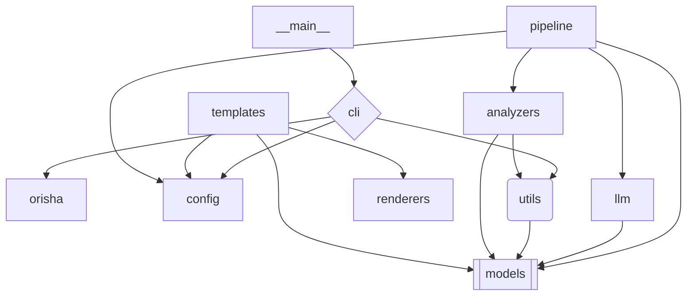

# orisha System Documentation

> Auto-generated by [Orisha](https://github.com/your-org/orisha) on 2026-02-02 01:00:30 UTC
> Git Reference: 5908ecf82d7db803db7836c72d3d9630e477ab0f

---

## Table of Contents

1. [Overview](#overview)
2. [Technology Stack](#technology-stack)
3. [Dependencies](#dependencies)
5. [System Flow](#system-flow)
6. [Version History](#version-history)
7. [Analysis Metadata](#analysis-metadata)

---

## Overview

**Purpose**: Orisha is an automated system documentation generator that analyzes codebases to produce comprehensive technical documentation.

**Architecture**: CLI Tool

**Core Components**:
- analyzers: Performs deterministic code analysis including AST parsing, dependency detection, and SBOM generation
- llm: Provides unified LLM access via LiteLLM for generating documentation summaries
- models: Defines canonical data models for representing analysis results
- renderers: Renders analysis data into documentation formats like Markdown
- templates: Manages Jinja2 templates for rendering documentation

**Data Flow**: The system ingests source code, performs static analysis, queries LLMs for summaries, and renders documentation from the combined analysis data.

**Design Patterns**: Adapter, Facade, Template Method

**Entry Points**: __main__, cli.main()

---

## Technology Stack

Python (2 files). Version 3.11 or later detected.

The key frameworks and libraries used are typer, typer-config, tree-sitter, litellm, jinja2, pyyaml, rich, boto3, and aiohappyeyeballs.

The system uses the PyPI ecosystem with a total of 151 packages, including 23 direct dependencies.

| Component | Type | Description | Version |
|-----------|------|-------------|---------|
| **Python** | Language | Primary language | >=3.11 |
| **python** | Language | 79 source files | — |

---

## Dependencies

| Metric | Value |
|--------|-------|
| **Direct Dependencies** | 23 packages |
| **Total (incl. transitive)** | 151 packages |
| **Ecosystems** | pypi |
| **SBOM Tool** | syft 1.39.0 |

The pypi ecosystem is used, with 23 direct dependencies and a total of 151 packages including transitive dependencies.

The most important direct dependency packages by name are boto3, jinja2, litellm, mypy, pytest, and pytest-cov.

### Direct Dependencies

**PYPI** (23 packages)

| Package | Purpose | Version | License |
|---------|---------|---------|---------|
| boto3 | — | 1.42.39 | Apache-2.0 |
| boto3 | — | 1.42.39 | — |
| jinja2 | — | 3.1.6 | — |
| jinja2 | — | 3.1.6 | — |
| litellm | — | 1.81.5 | MIT |
| litellm | — | 1.81.5 | — |
| mypy | — | 1.19.1 | — |
| pytest | — | 9.0.2 | MIT |
| pytest | — | 9.0.2 | — |
| pytest-cov | — | 7.0.0 | — |
| pyyaml | — | 6.0.3 | MIT |
| pyyaml | — | 6.0.3 | — |
| rich | — | 14.3.1 | MIT |
| rich | — | 14.3.1 | — |
| ruff | — | 0.14.14 | — |
| tree-sitter | — | 0.25.2 | — |
| tree-sitter | — | 0.25.2 | — |
| tree-sitter-language-pack | — | 0.13.0 | MIT OR Apache-2.0 |
| tree-sitter-language-pack | — | 0.13.0 | — |
| typer | — | 0.21.1 | MIT |
| typer | — | 0.21.1 | — |
| typer-config | — | 1.4.3 | MIT |
| typer-config | — | 1.4.3 | — |

### Development Dependencies

| Package | Purpose | Version |
|---------|---------|---------|
| pytest | Development tooling | 8.0.0 |
| pytest-cov | Development tooling | 4.0.0 |
| ruff | Development tooling | 0.1.0 |
| mypy | Development tooling | 1.0.0 |

---

## System Flow

### Module Dependencies

The following diagram shows the relationships between modules in this codebase:

> *Note: This diagram has been simplified from 11 nodes for readability.*

### Modules

| Module | Files | Key Functions |
|--------|-------|---------------|
| `orisha` | 5 | - |
| `orisha/renderers` | 2 | - |
| `orisha/analyzers` | 10 | - |
| `orisha/analyzers/sbom` | 3 | - |
| `orisha/analyzers/diagrams` | 4 | - |
| `orisha/analyzers/repomix` | 2 | - |
| `orisha/llm` | 3 | - |
| `orisha/utils` | 4 | - |
| `orisha/models` | 4 | - |
| `orisha/models/canonical` | 6 | - |
| `orisha/templates` | 2 | - |

### Entry Points

Entry points are the public interfaces where external systems interact with this codebase:

| Name | Type | File | Description |
|------|------|------|-------------|
| `check` | cli_command | src/orisha/cli.py:119 | - |
| `write` | cli_command | src/orisha/cli.py:215 | - |
| `init` | cli_command | src/orisha/cli.py:489 | - |
| `validate` | cli_command | src/orisha/cli.py:649 | - |
| `__main__` | main | src/orisha/cli.py:682 | Main entry point |
| `__main__` | main | src/orisha/__main__.py:13 | Main entry point |
| `__main__` | main | src/orisha/analyzers/ast_parser.py:528 | Main entry point |
| `__main__` | main | src/orisha/analyzers/ast_parser.py:529 | Main entry point |
| `__main__` | main | src/orisha/analyzers/ast_parser.py:532 | Main entry point |
| `__main__` | main | src/orisha/analyzers/entry_points.py:6 | Main entry point |
| `__main__` | main | src/orisha/analyzers/entry_points.py:230 | Main entry point |
| `__main__` | main | src/orisha/analyzers/entry_points.py:231 | Main entry point |

### External Integrations

This system connects to the following external services:

| Service | Type | Purpose |
|---------|------|---------|
| litellm | LLM | Provides LLM access for generating summaries |
| urllib | HTTP API | Used for preflight checks |

---

## Version History

| Version | Date | Author | Changes |
|---------|------|--------|---------|
| 1.0.0 | 2026-02-01 16:26:19 UTC | Orisha (automated) | Analyzed 2 languages, 142 dependencies; SBOM: 151 packages; Architecture: 0 resources |
| 1.0.1 | 2026-02-01 16:29:29 UTC | Orisha (automated) | Analyzed 2 languages, 142 dependencies; SBOM: 151 packages; Architecture: 0 resources |
| 1.0.2 | 2026-02-01 17:50:28 UTC | Orisha (automated) | Analyzed 2 languages, 142 dependencies; SBOM: 151 packages; Architecture: 0 resources |
| 1.0.3 | 2026-02-01 23:16:11 UTC | Orisha (automated) | Analyzed 2 languages, 142 dependencies; SBOM: 151 packages; Architecture: 0 resources |
| 1.0.4 | 2026-02-01 23:29:04 UTC | Orisha (automated) | Analyzed 2 languages, 142 dependencies; SBOM: 151 packages; Architecture: 0 resources |
| 1.0.5 | 2026-02-01 23:34:22 UTC | Orisha (automated) | Analyzed 2 languages, 142 dependencies; SBOM: 151 packages; Architecture: 0 resources |
| 1.0.6 | 2026-02-01 23:36:40 UTC | Orisha (automated) | Analyzed 2 languages, 142 dependencies; SBOM: 151 packages; Architecture: 0 resources |
| 1.0.7 | 2026-02-01 23:41:16 UTC | Orisha (automated) | Analyzed 2 languages, 142 dependencies; SBOM: 151 packages; Architecture: 0 resources |
| 1.0.8 | 2026-02-01 23:42:52 UTC | Orisha (automated) | Analyzed 2 languages, 142 dependencies; SBOM: 151 packages; Architecture: 0 resources |
| 1.0.9 | 2026-02-01 23:59:09 UTC | Orisha (automated) | Analyzed 2 languages, 142 dependencies; SBOM: 151 packages; Architecture: 0 resources |

---

## Analysis Metadata

### Tool Versions

| Tool | Version |
|------|---------|
| repomix | 1.11.0 |
| sbom | 1.39.0 |
| diagrams | terravision, version 0.11.2 |

### Analysis Status

- **Status**: completed
- **Timestamp**: 2026-02-02 01:00:30 UTC
- **Git Reference**: 5908ecf82d7db803db7836c72d3d9630e477ab0f

---

*Generated by Orisha System Documentation Generator*
