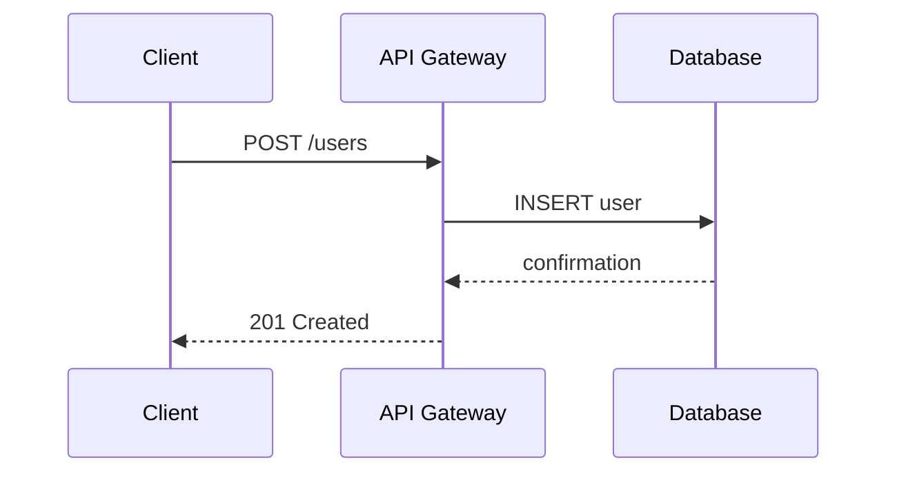
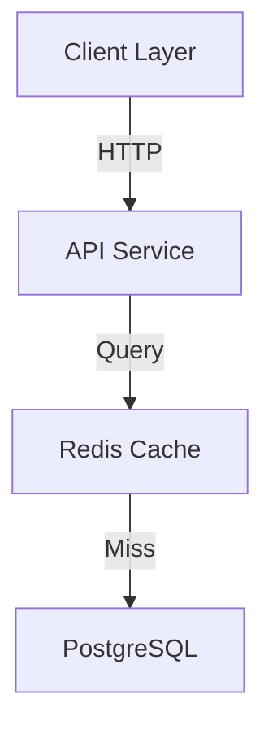
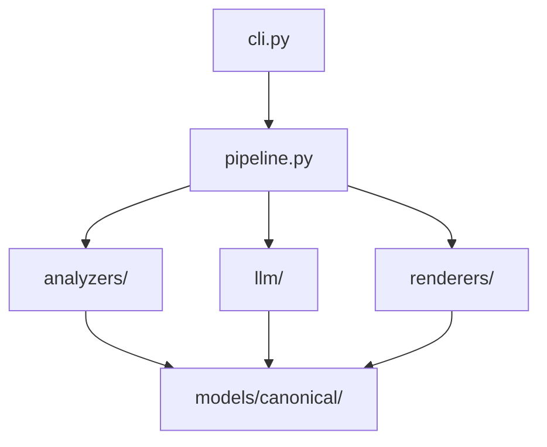

# Research: Orisha - Automated System Documentation Generator

**Date**: 2026-01-31
**Branch**: `001-system-doc-generator`

## 1. CLI Framework: Click vs Typer

### Decision: **Typer** with typer-config extension

### Rationale:
- Built on Click, providing all of Click's power with less boilerplate
- Type hints-based argument parsing reduces code duplication
- Supports subcommands via `@app.command()` decorators
- `typer-config` extension provides `@use_yaml_config`, `@use_toml_config` decorators for configuration file support
- No built-in "CI mode" but easy to implement via `--ci` flag or `CI=true` env var check
- Inherits Click's excellent error handling

### Alternatives Considered:
- **Click**: More mature but requires more boilerplate code
- **argparse**: Standard library but verbose and lacks built-in subcommand groups

---

## 2. Multi-Language AST Parsing

### Decision: **tree-sitter-language-pack** + **tree-sitter**

### Rationale:
- `tree-sitter-language-pack` is the actively maintained successor to `tree-sitter-languages`
- Bundles 100+ languages with pre-built wheels (no compilation needed)
- Supports Python 3.10+ and tree-sitter 0.25.x
- Zero GPL dependencies - all bundled languages use permissive licenses
- Full typing support for IDE integration

### Usage Pattern:
```python
from tree_sitter_language_pack import get_language, get_parser

python_parser = get_parser("python")
js_parser = get_parser("javascript")
go_parser = get_parser("go")
java_parser = get_parser("java")

tree = python_parser.parse(bytes(source_code, "utf8"))
```

### Alternatives Considered:
- **Individual language packages**: More granular but requires managing multiple dependencies
- **tree-sitter-languages**: Now unmaintained; avoid for new projects

---

## 3. Unified LLM Access

### Decision: **LiteLLM**

### Rationale:
- Confirmed support for all required providers:
  - Claude (Anthropic): `anthropic/claude-3-5-sonnet-20241022`
  - Gemini (Google): `gemini/gemini-pro`
  - Ollama (local): `ollama/llama2` with `api_base="http://localhost:11434"`
- Unified `completion()` API across 100+ providers
- Built-in cost tracking, retries, fallbacks, and logging

### Deterministic Output Configuration:
```python
import litellm

response = litellm.completion(
    model="anthropic/claude-3-5-sonnet-20241022",
    messages=[{"role": "user", "content": prompt}],
    temperature=0,  # Greedy decoding - most deterministic
    seed=42,        # Optional - only matters if temperature > 0
)
```

### Important Caveat:
Temperature=0 is necessary but not sufficient for perfect determinism. Design the application to be robust to minor output variations rather than expecting bit-perfect reproducibility. This aligns with SC-005 which exempts punctuation and filler words from reproducibility requirements.

### Alternatives Considered:
- **Direct SDKs** (anthropic, google-generativeai, ollama): More control but requires maintaining multiple integrations
- **LangChain**: Heavier framework; overkill for this use case

---

## 4. SBOM Generation: Syft Integration

### Decision: **Invoke Syft via subprocess.run() with JSON output**

### Rationale:
- Industry-standard SBOM generator from Anchore
- Runs client-side with no cloud dependencies
- Supports multiple output formats (Syft JSON, CycloneDX, SPDX)
- Comprehensive scanning across multiple package ecosystems

### Integration Pattern:
```python
import subprocess
import json

def generate_sbom(target: str, format: str = "json") -> dict:
    result = subprocess.run(
        ["syft", target, "-o", format, "-q"],
        capture_output=True,
        text=True,
        check=True,
        timeout=300
    )
    return json.loads(result.stdout)
```

### Output Formats:
| Format | Flag | Use Case |
|--------|------|----------|
| Syft JSON | `-o json` | Most comprehensive |
| CycloneDX JSON | `-o cyclonedx-json` | Security-focused standard |
| SPDX JSON | `-o spdx-json` | Compliance-focused standard |

### Alternatives Considered:
- **Syft Go library**: Would require CGO bindings; subprocess is simpler
- **Python-native tools** (pip-licenses, pipdeptree): Less comprehensive

---

## 5. Terraform Diagram Generation: Terravision Integration

### Decision: **Invoke Terravision via subprocess.run()**

### Rationale:
- Purpose-built for CI/CD pipeline integration ("Docs as Code")
- Client-side only - no Terraform or cloud access required
- Multi-cloud support: AWS, Google Cloud, Azure
- Can read directly from Git repositories

### Prerequisites:
- Python 3.10+
- Graphviz (for diagram rendering)
- Git (for remote repos)

### Integration Pattern:
```python
import subprocess
from pathlib import Path

def generate_terraform_diagram(source: str, output_file: str = "architecture.png") -> Path:
    cmd = ["terravision", "draw", "--source", source, "--output", output_file]
    subprocess.run(cmd, capture_output=True, text=True, check=True, timeout=120)
    return Path(output_file)
```

### Alternatives Considered:
- **terraform graph**: Native to Terraform but produces raw DOT format requiring manual processing
- **Pluralith**: Commercial alternative with more features but requires account/API access
- **Inframap**: Open-source but less actively maintained

---

## Summary: Technology Stack

| Component | Choice | Package/Tool |
|-----------|--------|--------------|
| CLI Framework | Typer | `typer`, `typer-config` |
| AST Parsing | tree-sitter | `tree-sitter`, `tree-sitter-language-pack` |
| LLM Access | LiteLLM | `litellm` |
| SBOM Generation | Syft | External CLI tool |
| Terraform Diagrams | Terravision | External CLI tool |
| Templating | Jinja2 | `jinja2` |
| Codebase Compression | Repomix | External CLI tool (`npm install -g repomix`) |

## Resolved Clarifications

| Item | Resolution |
|------|------------|
| CLI Framework | Typer (not Click) |
| AST Library | tree-sitter-language-pack |
| LLM Determinism | temperature=0, accept minor variations per SC-005 |

---

# Phase 5: Code Explanation Feature Research

**Date**: 2026-02-01

## R01: Docstring Extraction per Language

### Decision
Use tree-sitter node types to extract docstrings from each supported language.

### Findings

| Language | Docstring Location | Tree-sitter Node Type |
|----------|-------------------|----------------------|
| **Python** | First statement in function body if string literal | `expression_statement` → `string` (check if first child of `block`) |
| **JavaScript** | JSDoc comment before function | `comment` (starts with `/**`) preceding `function_declaration` |
| **TypeScript** | Same as JavaScript (JSDoc) | `comment` (starts with `/**`) preceding `function_declaration` |
| **Go** | Comment line(s) immediately before func | `comment` nodes preceding `function_declaration` |
| **Java** | Javadoc comment before method | `comment` (starts with `/**`) preceding `method_declaration` |

### Implementation Approach

1. **Python**: After parsing function, check if first statement is a string expression
2. **JSDoc/Javadoc languages**: Look for preceding sibling comment starting with `/**`
3. **Go**: Concatenate consecutive comments before function

### Alternatives Considered

| Alternative | Why Rejected |
|-------------|--------------|
| Regex extraction from source | Not AST-aware, would break on edge cases |
| Language-specific parsers (ast module for Python) | Would require separate implementation per language |
| External doc generation tools (pydoc, jsdoc) | Adds external dependencies |

---

## R02: Token Budget Management

### Decision
Batch functions by file with max 20 functions per LLM call. Include truncated context (docstring + first 5 lines of body).

### Findings

**Token Estimates per Function**:

| Component | Typical Tokens |
|-----------|---------------|
| Function name + signature | 10-20 |
| Docstring (if exists) | 20-100 |
| First 5 lines of body | 30-80 |
| **Total per function in prompt** | ~50-200 |

**Batch Sizing**:
- 20 functions per batch = ~1000-4000 tokens input
- Response: ~60 tokens/function = ~1200 tokens output
- Total per batch = ~5000 tokens (within context limits)

### Alternatives Considered

| Alternative | Why Rejected |
|-------------|--------------|
| One LLM call per function | Too slow, expensive, rate limiting |
| Send full function bodies | Exceeds token limits for large functions |
| Single call for all functions | May exceed context window |

---

## R03: Explanation Prompt Design

### Decision
Use structured prompting with numbered list format for easy parsing.

### Prompt Structure

```
You are documenting a codebase for enterprise IT documentation.

For each function below, provide a 1-2 sentence technical explanation of:
- What the function does
- Its primary purpose in the system

Be specific and technical. Use actual names from the code.
Do NOT use phrases like "appears to", "seems to", "probably".

Functions to explain:

1. checkRateLimit(clientId)
   Docstring: "Check if client is within rate limits"
   Code snippet: [first 5 lines]

Respond in format:
1. [explanation]
2. [explanation]
```

### Alternatives Considered

| Alternative | Why Rejected |
|-------------|--------------|
| JSON response | Some LLMs inconsistent with JSON |
| Markdown tables | Harder to parse |

---

## R04: Template Design

### Decision
Use separate "Function Reference" subsection with detailed explanations, grouped by file.

### Template Structure

```markdown
## Code Structure

{LLM summary of overall code organization}

### Module Overview

| Module | Language | Purpose |
|--------|----------|---------|
| lambda/index.mjs | JavaScript | API handler |

### Function Reference

#### lambda/index.mjs

**checkRateLimit(clientId)**
Validates whether the client has exceeded their API rate limit.

**incrementUsage(clientId, count)**
Increments the API usage counter in DynamoDB.
```

### Alternatives Considered

| Alternative | Why Rejected |
|-------------|--------------|
| Table with description column | Descriptions too long for cells |
| Separate reference document | Fragments documentation |

---

## Summary of Code Explanation Decisions

| Question | Decision |
|----------|----------|
| Docstring Extraction | tree-sitter node types per language |
| Token Budget | Batch 20 functions/call, truncated context |
| Prompt Design | Numbered list format |
| Template Design | "Function Reference" subsection by file |

---

# Phase 6: Mermaid Data Flow Diagram Research

**Date**: 2026-02-01

## R05: Mermaid Diagram Types for Data Flow

### Decision
Use **Sequence Diagrams** for request/data flows and **Flowcharts** for component connectivity.

### Findings

| Diagram Type | Best For | When to Use |
|--------------|----------|-------------|
| **Sequence Diagram** | Request/response flows, service interactions | API endpoint documentation, showing timing/order |
| **Flowchart (TD/LR)** | Component relationships, decision trees | Internal processing logic, architecture overview |
| **Graph** | Module dependencies, connectivity | Import relationships, service topology |

### Syntax Examples

**Sequence Diagram** (request flow):


**Flowchart** (component connectivity):


### Recommendation

- **Primary**: Sequence diagrams for API request/response flows
- **Secondary**: Flowcharts for component architecture/connectivity
- **Tertiary**: Graph diagrams for module dependencies

---

## R06: AST Extraction for Data Flow

### Decision
Extract entry points, call chains, and external service calls using tree-sitter queries.

### Entry Point Detection Patterns

| Framework | Pattern | Tree-sitter Detection |
|-----------|---------|----------------------|
| **FastAPI** | `@app.get()`, `@app.post()` | Decorator nodes before `function_definition` |
| **Flask** | `@app.route()`, `@bp.route()` | Same decorator pattern |
| **Express.js** | `app.get()`, `router.post()` | `call_expression` with callee matching `app.get\|post` |
| **Go HTTP** | `func handle(w http.ResponseWriter, r *http.Request)` | Function signature with ResponseWriter param |
| **Django** | Class views, URL patterns | Class inheritance from `View`, `urls.py` patterns |

### External Service Call Detection

| Service Type | Detection Pattern | Libraries to Match |
|--------------|------------------|-------------------|
| **HTTP** | Method calls on HTTP clients | `requests.`, `httpx.`, `fetch()`, `axios.` |
| **Database** | Method calls on session/conn objects | `session.query()`, `db.execute()`, `cursor.` |
| **Queue** | Send/publish calls | `queue.send()`, `producer.send()`, `boto3.client('sqs')` |
| **Cache** | Get/set calls | `redis.get()`, `cache.set()`, `memcached.` |

### Call Graph Extraction

```python
def extract_call_graph(tree, language):
    """Build function call relationships"""
    calls = {}  # func_name -> [called_functions]

    for func_node in find_functions(tree):
        func_name = get_function_name(func_node)
        calls[func_name] = []

        for call in find_calls_in_body(func_node):
            called_func = extract_function_name(call)
            calls[func_name].append({
                'name': called_func,
                'external': is_external_call(called_func),
                'type': classify_external_call(called_func)
            })
    return calls
```

---

## R07: Complexity Management for Large Codebases

### Decision
Implement tiered diagram generation based on node count with automatic simplification.

### Size Thresholds

| Node Count | Detail Level | Strategy |
|------------|--------------|----------|
| **< 15** | Full function detail | Show complete call chain |
| **15-40** | Module/service level | Group by module, collapse internals |
| **40+** | Architecture level | Entry points → external services only |
| **100+** | Multiple diagrams | Per-feature or per-endpoint diagrams |

### Filtering Strategies

1. **Entry Point Focus**: Start from API endpoints/handlers, limit depth to 3 levels
2. **Node Grouping**: Collapse functions into modules/layers
3. **External Only**: Show only calls that cross service boundaries
4. **Subgraph Clustering**: Use Mermaid subgraphs to group related components

### Layout Optimization

- Use **ELK layout engine** for diagrams with 50+ nodes (vs default Dagre)
- Implement Mermaid-Sonar complexity detection to warn when > 40 nodes
- Generate multiple focused diagrams instead of one monolithic diagram

---

## R08: Existing Tools and Libraries

### Decision
Build custom tree-sitter extraction; reference existing tools for patterns.

### Python Libraries for Reference

| Library | Purpose | Notes |
|---------|---------|-------|
| **Flomatic** | Python AST → Mermaid flowcharts | Good reference for AST traversal patterns |
| **PyCG** | Static call graph generation | High precision (~99.2%), good for validation |
| **Pyan3** | Call dependency graphs → GraphViz | Mature implementation, Python 3.9+ |
| **pymermaider** | Class diagrams from Python | Rust-based, fast for large codebases |

### Why Custom Implementation

| Alternative | Why Rejected |
|-------------|--------------|
| Use PyCG directly | Python-only, doesn't integrate with tree-sitter multi-language approach |
| Pyan3 GraphViz output | Extra conversion step, loses control over diagram style |
| Flomatic | Only handles Python, focused on internal function flow |

### Recommended Approach

1. Use tree-sitter for multi-language AST parsing (already implemented)
2. Build call graph extraction as extension of existing `ast_parser.py`
3. Implement Mermaid generation layer that converts call graphs to diagrams
4. Reference PyCG patterns for complex scenarios (closures, decorators)

---

## R09: Data Flow Canonical Format

### Decision
Add CanonicalDataFlow to the data model for data flow analysis results.

### Proposed Schema

```python
@dataclass
class CanonicalDataFlow:
    """Data flow and request paths in the system"""
    entry_points: list[EntryPointFlow]
    call_chains: list[CallChain]
    external_services: list[ExternalServiceCall]
    diagrams: list[MermaidDiagram]
    source: DataFlowAnalysisSource

@dataclass
class EntryPointFlow:
    name: str
    type: str  # "api_endpoint", "handler", "main", "cli_command"
    framework: str | None  # "fastapi", "flask", "express", etc
    path: str | None  # URL path for APIs
    method: str | None  # HTTP method
    file: str
    line: int

@dataclass
class CallChain:
    entry_point: str
    chain: list[str]  # [func_a, func_b, external_service]
    external_calls: list[ExternalServiceCall]
    depth: int

@dataclass
class ExternalServiceCall:
    call_site: str  # Function making the call
    service_type: str  # "http", "database", "queue", "cache"
    service_name: str  # "requests", "sqlalchemy", "boto3", etc
    file: str
    line: int
    details: dict  # URL pattern, DB type, etc

@dataclass
class MermaidDiagram:
    diagram_type: str  # "sequence", "flowchart", "graph"
    title: str
    content: str  # Mermaid syntax
    node_count: int
    source_entry_points: list[str]
```

---

## Summary of Data Flow Diagram Decisions

| Question | Decision |
|----------|----------|
| Diagram Type | Sequence (requests) + Flowchart (architecture) |
| AST Extraction | Tree-sitter queries for entry points, call chains, external calls |
| Complexity Limit | Auto-simplify at 40+ nodes |
| Multi-language | Extend existing tree-sitter patterns per language |
| Canonical Format | New CanonicalDataFlow model with MermaidDiagram output |

---

# Phase 7: Incremental Documentation Updates (Caching)

**Date**: 2026-02-01

## R10: File Change Detection Method

### Decision
Use **Git-based detection** (`git diff --name-only`) for file change detection.

### Findings

| Method | Pros | Cons |
|--------|------|------|
| Git-based (git diff HEAD) | Fast, includes uncommitted changes, already tracked | Requires git repo |
| Content hash (SHA-256) | Works without git | Computational overhead, must hash all files |
| Modification time (mtime) | Fast | Unreliable (timezone issues, git checkout resets mtime) |

### Git Commands for Change Detection

```bash
# Files changed since last cache (comparing against cached git_ref)
git diff --name-only <cached_git_ref> HEAD

# Uncommitted changes (staged + unstaged)
git diff --name-only HEAD

# Combined: all changes since cache was created
git diff --name-only <cached_git_ref>  # includes HEAD + working tree
```

### Rationale
1. **Fast** - Git already indexes the working tree, no file I/O needed
2. **Includes uncommitted changes** - `git diff HEAD` shows modified files in working tree
3. **Already required** - Orisha requires git repos anyway (for git_ref tracking)
4. **Deterministic** - Same working tree state = same diff output

### Fallback for Non-Git Repos
If not a git repo, fall back to full regeneration (no caching). This is acceptable since:
- Orisha already warns when not in a git repo
- Non-git usage is rare edge case
- Constitution Principle II (Reproducibility) requires git_ref anyway

---

## R11: Cache Key Strategy

### Decision
Use **File-level cache with function storage**:
- Cache key: `file_path -> file_hash` for change detection
- Storage key: `file_path:line:name` for explanation lookup
- If file hash changes, invalidate ALL functions in that file

### Rationale
1. Most edits change a file, rarely do you modify just one function
2. File-level invalidation is conservative but correct
3. Avoids complexity of tracking moved/renamed functions
4. Line number in key helps distinguish overloaded function names

### Alternatives Rejected
- Pure function-level: Too complex to track function identity across edits
- AST signature: Requires parsing before cache lookup, defeats performance goal

---

## R12: Cache Invalidation Triggers

### Decision
Invalidate entire cache when ANY of these change:
1. **Orisha version** - LLM prompts may have changed
2. **LLM model** - Different model = different explanations
3. **Cache format version** - Incompatible cache structure

### NOT invalidated by
- Python version (LLM prompts unchanged)
- OS/platform (content-based caching)
- Time elapsed (explanations don't expire)

---

## R13: Performance Estimates

### Cache Operations

| Operation | Time |
|-----------|------|
| `git diff --name-only` | ~5ms |
| JSON cache load (1MB) | ~10ms |
| JSON cache save (1MB) | ~20ms |
| **Total cache overhead** | **<50ms** |

### LLM Call Reduction

For Orisha codebase (42 functions, 158 classes = 200 items):

| Scenario | Without Cache | With Cache | Savings |
|----------|--------------|------------|---------|
| Initial run | 200 calls | 200 calls | 0% |
| No changes | 200 calls | 0 calls | 100% |
| 1 file edited | 200 calls | ~10 calls | 95% |
| 5 files edited | 200 calls | ~50 calls | 75% |

---

## Summary of Incremental Update Decisions

| Question | Decision |
|----------|----------|
| Change Detection | Git-based (`git diff --name-only`) |
| Cache Key | `git_ref` when cache was created |
| Storage Key | `file_path:line:name` for explanations |
| Invalidation | On Orisha version, LLM model, or cache format change |
| File Granularity | Invalidate all functions in changed files |
| Cache Location | `.orisha/cache.json` (committable or gitignored) |
| Non-git Fallback | Full regeneration (no caching) |

---

# Phase 8: Flow-Based Code Documentation

**Date**: 2026-02-01

## R14: Code Structure Documentation Strategy

### Decision
Replace **function-by-function explanations** with **flow-based documentation** for the Code Structure section.

### Problem Statement
The current Phase 4d approach generates LLM explanations for every function and class in the codebase. For a repository with 200 functions, this results in:
- 200 LLM API calls (expensive, slow)
- A documentation section listing every function individually
- Information overload for the target audience (enterprise IT audit, architecture stakeholders)

Enterprise architects and auditors need to understand:
- "How does a request flow through this system?"
- "What are the main modules and their responsibilities?"
- "Where are the integration points with external services?"

They do **not** need:
- "What does `_parse_config_line()` on line 247 do?"
- Individual explanations for every helper function

### New Approach: Flow-Based Documentation

The Code Structure section will now contain:

1. **Module Overview** (deterministic + LLM summary)
   - Table of modules/packages with their responsibilities
   - One LLM call per module (~10 modules) instead of per function (~200 functions)

2. **System Flow Diagram** (deterministic Mermaid)
   - Generated from AST import graph analysis
   - Shows how modules connect and data flows through the system

3. **Entry Points** (deterministic)
   - API endpoints, CLI commands, handlers
   - Only public-facing interfaces, not internal functions

4. **External Integration Points** (deterministic + LLM)
   - Where the system connects to databases, APIs, queues
   - Detected via library call patterns (requests, SQLAlchemy, boto3)

### Benefits

| Metric | Function-by-Function | Flow-Based |
|--------|---------------------|------------|
| LLM calls (200 function repo) | ~200 | ~15-20 |
| Documentation length | Very long (200 entries) | Concise (10-15 entries) |
| Target audience alignment | Developer reference | Architecture/audit |
| Cache benefit | High (per function) | Lower (per module) |
| Scalability | Poor (linear with functions) | Good (linear with modules) |

---

## R15: Module Detection and Summarization

### Decision
Detect modules at the **package/directory level** and generate one LLM summary per module.

### Module Detection Rules

| Language | Module Boundary |
|----------|----------------|
| Python | Directory with `__init__.py` or standalone `.py` file |
| JavaScript/TypeScript | Directory with `index.js`/`index.ts` or standalone file |
| Go | Directory (Go package) |
| Java | Directory matching package structure |

### Module Summary Prompt Strategy

Instead of asking about individual functions, ask:
```
Given this module's structure:
- Module: src/orisha/analyzers/
- Files: ast_parser.py, dependency.py, sbom/syft.py
- Key classes: ASTParser, DependencyParser, SyftAdapter
- Key functions: parse_python_ast, extract_dependencies

Provide a 2-3 sentence summary of:
1. What this module's responsibility is
2. How it fits into the overall system
```

### Token Efficiency

| Approach | Tokens per Item | Items | Total Tokens |
|----------|----------------|-------|--------------|
| Function explanations | ~200 | 200 | ~40,000 |
| Module summaries | ~500 | 10 | ~5,000 |

**8x reduction in token usage.**

---

## R16: System Flow Diagram Generation

### Decision
Generate a **Mermaid flowchart** showing module relationships from AST import analysis.

### Extraction Algorithm

1. For each source file, extract import statements
2. Map imports to internal modules (ignore external packages)
3. Build directed graph: `importing_module → imported_module`
4. Generate Mermaid flowchart from graph

### Example Output



### Complexity Management

| Node Count | Action |
|------------|--------|
| < 15 | Show all modules |
| 15-30 | Group sub-modules (e.g., `analyzers/*` → `Analyzers`) |
| 30+ | Show only top-level packages |

---

## R17: Entry Point Detection

### Decision
Document only **entry points** (public interfaces) rather than all functions.

### Entry Point Types

| Type | Detection Pattern |
|------|------------------|
| CLI Commands | `@app.command()` decorators (Typer) |
| API Endpoints | `@app.get/post/put/delete()` decorators |
| Main Functions | `if __name__ == "__main__"` |
| Handlers | Functions matching handler signatures |

### Template Output

```markdown
### Entry Points

| Entry Point | Type | Location | Description |
|-------------|------|----------|-------------|
| `orisha write` | CLI | cli.py:45 | Generate documentation |
| `orisha check` | CLI | cli.py:78 | Validate tool availability |
| `orisha init` | CLI | cli.py:92 | Initialize configuration |
```

### What NOT to Document

- Private functions (`_helper()`)
- Internal utility functions
- Test fixtures
- Constants and configuration

---

## Summary of Flow-Based Documentation Decisions

| Question | Decision |
|----------|----------|
| Documentation granularity | Module-level, not function-level |
| LLM usage | One summary per module (~10 calls vs ~200) |
| Diagram type | Mermaid flowchart from import graph |
| Entry points | CLI commands, API endpoints, handlers only |
| External integrations | Detect via library call patterns |
| Complexity management | Group sub-modules when >15 nodes |
| Caching impact | Still beneficial for module summaries |

---

## R18: LLM Output Quality - No Negative Assertions

### Decision
Remove all "negative assertions" from LLM output. If something doesn't exist or can't be determined, **omit it entirely** rather than stating its absence.

### Problem Statement
Current LLM prompts produce unhelpful filler text when analysis doesn't find something:

**Bad Examples (current behavior):**
- "Not determinable from analysis: specific AWS services or frameworks used."
- "No Terraform detected"
- "Infrastructure details: Unable to determine from codebase"
- "No message queues identified"
- "Cloud provider: Not specified in codebase"

These statements add no value and clutter the documentation. Enterprise architects don't need to know what *isn't* there.

### New Behavior
When something isn't detected or determinable:

| Scenario | Old Behavior | New Behavior |
|----------|-------------|--------------|
| No Terraform files | "No Terraform detected" | "N/A" |
| No cloud services | "Cloud provider: Not determinable" | "N/A" |
| No message queues | "Message queues: None identified" | "N/A" |
| Can't determine framework | "Framework: Unable to determine" | "N/A" or generic "Python application" |

**Rationale**: Showing "N/A" is better than hiding sections entirely because:
1. Users know the section was analyzed (not a bug)
2. Consistent document structure across different repositories
3. Clear that absence is intentional, not an error

### Implementation

**1. Prompt Instructions**
Add explicit instructions to all LLM prompts:

```text
IMPORTANT: Only include information that IS present in the codebase.
- Do NOT say "not found", "not detected", "unable to determine", "none identified"
- If a section has no relevant content, output "N/A"
- If a field cannot be determined, output "N/A"
- Keep sections visible with "N/A" so users know the analysis ran
```

**2. Template Conditional Rendering**
Jinja2 templates should show "N/A" for empty sections:

```jinja2
## Infrastructure

{{ analysis.infrastructure }}

N/A

```

**3. Post-Processing Filter**
As a safety net, add a post-processing step to replace common negative patterns with "N/A":
- Lines containing "not detected", "not found", "unable to determine" → "N/A"
- Sections with only negative assertions → "N/A"
- Empty bullet points → remove or "N/A"

### Affected Prompts

| Prompt | Change Required |
|--------|-----------------|
| `OVERVIEW_PROMPT` | Add "omit if not determinable" instruction |
| `TECH_STACK_PROMPT` | Add "only include detected technologies" |
| `MODULE_SUMMARY_PROMPT` | Add "omit empty sections" instruction |
| `ARCHITECTURE_PROMPT` | Add conditional section guidance |
| All section prompts | Add standard "no negative assertions" block |

### Benefits

1. **Cleaner documentation** - No filler text
2. **Shorter output** - Only meaningful content
3. **Better UX** - Readers see what exists, not what doesn't
4. **Reduced token usage** - Less wasted LLM output

---

# Phase 4g: Repomix Integration for Codebase Summarization (CRITICAL - Before Phase 5)

**Date**: 2026-02-01

## R19: Codebase Compression for LLM Analysis

### Problem Statement

The current flow-based documentation (Phase 4e) still generates summaries that are too granular for high-level enterprise documentation. Module-by-module analysis results in:
- Too many LLM calls (one per module)
- Summaries that lack holistic system understanding
- Missing cross-cutting concerns and architectural patterns

Enterprise stakeholders need:
- "What does this system do overall?"
- "What are the major architectural patterns?"
- "How does the system fit together as a whole?"

### Decision: **Repomix for Codebase Compression**

Use [Repomix](https://repomix.com/) to compress the entire codebase into an LLM-friendly format, enabling holistic system understanding with a single LLM call.

### What is Repomix?

Repomix is a tool that packs an entire repository into a single, AI-friendly file. Key features:
- **Code Compression**: Uses Tree-sitter to extract function signatures, class structures, and type definitions while removing implementation bodies (~70% token reduction)
- **Exclude Patterns**: Respects `.gitignore` and custom ignore patterns (e.g., `tests/*`, `node_modules/*`)
- **Multiple Formats**: XML (default), Markdown, JSON, Plain Text
- **Token Counting**: Reports token usage per file and total

### How Compression Works

The `--compress` flag uses Tree-sitter to:
1. **Preserve**: Function/method signatures, interface/type definitions, class structures, property declarations
2. **Remove**: Function bodies, loop/conditional logic, internal variable declarations

**Example**:
```python
# Original (120 tokens)
def process_data(items: list[Item], config: Config) -> Result:
    validated = []
    for item in items:
        if item.is_valid():
            transformed = transform(item, config)
            validated.append(transformed)
    return Result(items=validated, count=len(validated))

# Compressed (25 tokens)
def process_data(items: list[Item], config: Config) -> Result:
    ⋮----
```

### Integration Pattern

```python
import subprocess
import json

def compress_codebase(repo_path: str, exclude_patterns: list[str]) -> str:
    """Compress codebase for LLM analysis using Repomix."""
    cmd = [
        "repomix",
        repo_path,
        "--compress",
        "--style", "markdown",
        "--remove-comments",
        "--remove-empty-lines",
        "--no-file-summary",
        "--stdout",
    ]

    # Add exclude patterns
    for pattern in exclude_patterns:
        cmd.extend(["--ignore", pattern])

    result = subprocess.run(
        cmd,
        capture_output=True,
        text=True,
        check=True,
        timeout=300
    )
    return result.stdout
```

### Default Exclude Patterns

```python
DEFAULT_EXCLUDE = [
    # Test directories
    "tests/*",
    "test/*",
    "__tests__/*",
    "*.test.*",
    "*.spec.*",
    # Node.js
    "node_modules/*",
    "dist/*",
    "build/*",
    "coverage/*",
    "*.min.js",
    "*.bundle.js",
    # Python
    "__pycache__/*",
    ".venv/*",
    "venv/*",
    ".pytest_cache/*",
    "*.egg-info/*",
    # General
    ".git/*",
    "vendor/*",
    ".env",
    "*.lock",
]
```

### Usage in Orisha Pipeline

1. **New Stage**: Add Repomix compression as Stage 1b (after preflight, before AST parsing)
2. **Single LLM Call**: Send compressed codebase for holistic overview
3. **Complement Module Summaries**: Use holistic summary for Overview section, module summaries for details

### Token Efficiency

| Approach | Tokens | LLM Calls |
|----------|--------|-----------|
| Full codebase | ~100,000 | Impossible (exceeds context) |
| Module-by-module | ~5,000 | 10-20 calls |
| **Repomix compressed** | **~15,000** | **1 call** |

### Alternatives Considered

| Alternative | Why Rejected |
|-------------|--------------|
| Custom tree-sitter skeleton extractor | Reinventing the wheel; Repomix already solved this |
| Send full file contents | Exceeds context limits for most codebases |
| Module-by-module only | Lacks holistic understanding |

### Prerequisites

- Node.js (for npx) or install via: `npm install -g repomix`
- **REQUIRED**: Added to Orisha preflight check - fails if unavailable (like Syft, tree-sitter)

---

## R20: Repomix LLM Prompt Design

### Decision

Design a prompt that takes the compressed codebase and generates a high-level system overview.

### Prompt Template

```text
You are a senior software architect analyzing a codebase for enterprise documentation.

Below is a compressed representation of the codebase showing:
- All function and method signatures (without implementation bodies)
- Class and interface definitions
- Import relationships

Analyze this codebase and provide:

1. **System Purpose** (2-3 sentences): What is this system's primary function?

2. **Architecture Style**: Identify the architectural pattern (monolith, microservices, serverless, MVC, hexagonal, etc.)

3. **Core Components** (3-5 bullets): What are the main modules/packages and their responsibilities?

4. **Data Flow**: How does data flow through the system? (1-2 sentences)

5. **External Integrations**: What external services/APIs does this system interact with?

6. **Key Design Patterns**: What design patterns are evident? (factory, repository, observer, etc.)

IMPORTANT:
- Base analysis ONLY on code structure shown below
- Do NOT speculate about implementation details
- If something cannot be determined, omit it (do not say "not determinable")
- Use technical language appropriate for enterprise IT stakeholders

---

CODEBASE:

{compressed_codebase}
```

### Response Format

The LLM response becomes the Overview section content, complementing the current template-based sections.

---

## R21: Repomix Output Processing

### Decision

Parse Repomix output to extract metadata and content for template rendering.

### Output Structure

When using `--style markdown`, Repomix produces:
```markdown
# Repository: my-project

## Directory Structure
(tree view of files)

## Files

### path/to/file.py
```python
def function_signature():
    ⋮----
```
```

### Metadata Extraction

```python
@dataclass
class RepomixOutput:
    """Parsed Repomix output."""
    repository_name: str
    file_count: int
    total_tokens: int
    compressed_content: str
    directory_structure: str
```

---

## Summary of Repomix Integration Decisions

| Question | Decision |
|----------|----------|
| Tool | Repomix CLI via subprocess |
| Compression | `--compress` flag (tree-sitter skeleton extraction) |
| Output format | Markdown (`--style markdown`) |
| Exclude patterns | tests/*, node_modules/*, dist/*, build/* |
| LLM usage | Single call for holistic overview |
| Dependency | **REQUIRED** - no fallback (like Syft, Terravision) |
| Preflight | Mandatory check - fails if Repomix unavailable |
| Pipeline stage | Stage 1b (after preflight, before detailed analysis) |
